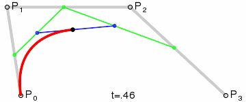
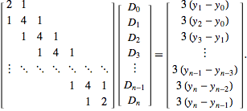

## 样条曲线拟合
图形学算法中的样条曲线拟合，拟合的最高阶数决定了拟合曲线的平滑程度。
### Talk is cheap, Show me the code.


### Liner Spline
线性拟合也就是一阶样条，属于直线拟合

### Quadratic Spline
二阶样条曲线拟合，属于抛物线拟合，在连接点边界处二阶导数不相等，大多数情况下可用，但是不够平滑

### Bezier Curve
贝塞尔曲线是比较简单的一种曲线，给定控制点后，使用插值方法很容易的可以求得二阶和三阶曲线。  
```cpp
//三阶贝塞尔曲线插值点计算
Vector2 start, ctl1, ctl2, end;
Vector<Vector2> intervalPoint;
Int segNum = 25;
float step = 1.0f / segNum;
for( auto t = 0; t <= 1; t+=step)
{
    auto point0 = Math::Lerp(start, ctl1, t);
    auto point1 = Math::Lerp(ctl1, ctl2, t);
    auto point2 = Math::Lerp(ctl2, end, t);
    
    auto point3 = Math::Lerp(point0, point1, t);
    auto point4 = Math::Lerp(point1, point2, t);
    intervalPoint.push_back(Math::Lerp(point3, point4, t));
}
```


### Cubic spline
三次样条曲线，根据边界条件包含多种类型，有Natual, Clamped, NotAKnot,对于算法的插值拟合计算，也有多种方法  
  
在每个[p[k],p[k+1]]区间求解上述三次曲线方程的四个系数a, b, c, d，N+1个点有N条曲线，4N个参数要计算，需要4N个方程
计算求解方程的条件如下：  
1. 曲线在端点处的0阶，1阶，2阶导数相等，也即曲线连续，这是保持平滑的条件
2. 一阶导数连续，有N-1个方程
3. 二阶导数连续，有N-1个方程
4. 前一曲线的结尾=后一曲线的开始，再加上0点和N+1点，所以有2(N-1)+2=2N个方程
5. 以上共有4N-2个方程
6. 剩下两个方程从曲线边界条件取得，由此区分出三种曲线，只是边界条件不一样。
7. Natural: 在首尾端点二阶导数为0
8. Clamped: 在首尾端点一阶导数为指定值
9. NotAKnot: 首尾端点的三阶导数和邻近点的三阶导数相等  

三次样条曲线的主要算法是使用高斯消元法(tdma)来计算三对角矩阵的中间矩阵  
  
```javascript
var tdma = function(L, R)
{
    var n = L.length - 1;

    var cpArray = [];
    var dpArray = [];

    var cp0 = L[0].c / L[0].b;
    cpArray.push(cp0);

    for( i = 1; i <= n; ++i)
    {
        var cpi = L[i].c / (L[i].b - L[i].a * cpArray[i - 1]);
        cpArray.push(cpi);
    }

    var dp0 = R[0] / L[0].b;
    dpArray.push(dp0);

    for(i = 1; i <= n; ++i)
    {
        var dpi = (R[i] - L[i].a * dpArray[i - 1]) / (L[i].b - L[i].a * cpArray[i - 1]);
        dpArray.push(dpi);
    }

    var m = [];
    m.push(dpArray[n]);
    for( i = n-1; i >= 0; i--)
    {
        m.unshift(dpArray[i] - cpArray[i] * m[0]);
    }

    return m
};
```

### Cardinal spline
属于厄尔密(Hermite )曲线的一种，包含了张量tension的可调整曲线参数  
  
包含张量参数c  
  

更具一下公式的主要算法步骤  

```javascript
var intervalPoints = [];

for( var i = 1; i < n; i++ )
{
    // t[k+1] - t[k - 1] = 2; because [t[k], t[k+1]] is a unit interval [0, 1]
    var m0x = (1 - tension) * (p[i+1].x - p[i - 1].x) / 2;
    var m0y = (1 - tension) * (p[i+1].y - p[i - 1].y) / 2;

    var m1x = (1 - tension) * (p[i+2].x - p[i].x) / 2;
    var m1y = (1 - tension) * (p[i+2].y - p[i].y) / 2;

    for( var j = 0; j <= segments; j++)
    {
        var x = h[j].h00 * p[i].x + h[j].h10 * m0x + h[j].h01 * p[i+1].x + h[j].h11 * m1x;
        var y = h[j].h00 * p[i].y + h[j].h10 * m0y + h[j].h01 * p[i+1].y + h[j].h11 * m1y;
        intervalPoints.push({x:x, y:y});
    }
}
return intervalPoints;
```

### 引用参考

[CubicSpline 参考1](https://www.cnblogs.com/flysun027/p/10371726.html)  
[NaturalCubicSpline 参考2](http://mathworld.wolfram.com/CubicSpline.html)  
[三次样条曲线](https://zhuanlan.zhihu.com/p/62860859)  
[三对角矩阵求解算法](https://zh.wikipedia.org/wiki/%E4%B8%89%E5%AF%B9%E8%A7%92%E7%9F%A9%E9%98%B5%E7%AE%97%E6%B3%95)  
[基数样条曲线](https://en.wikipedia.org/wiki/Cubic_Hermite_spline)  
